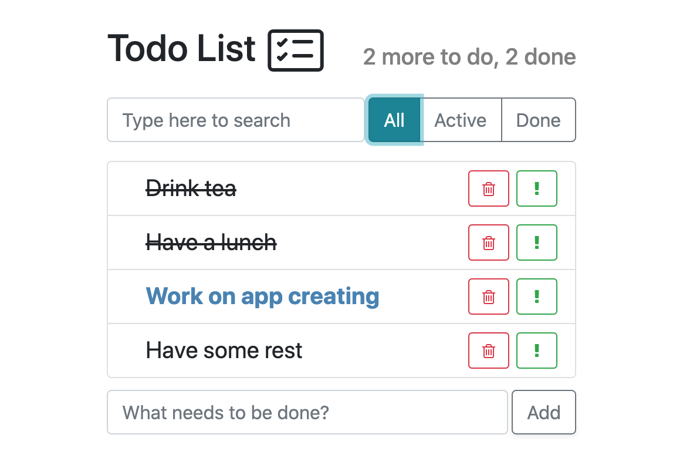

A simple todo list app built with React during my tutorial series on udemy.

## Available Scripts

In the project directory, you can run:

### `npm start`

Runs the app in the development mode. 

The page will reload if you make edits. 
You will also see any lint errors in the console.

### `npm test`

Launches the test runner in the interactive watch mode. 
Currently there are no available tests.